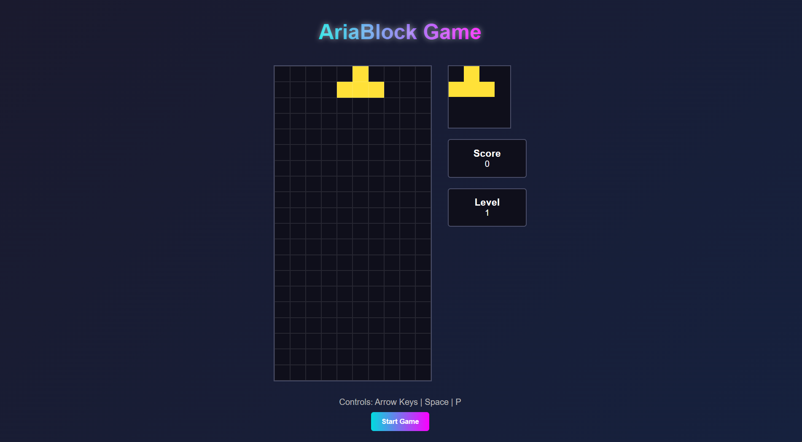

# AriaBlock (BlackBoxAI) 

"AriaBlock" is a simplified and engaging block-stacking game inspired by the classic mechanics of Tetris. Players control and arrange falling blocks to complete horizontal lines and score points. With a minimalist interface and smooth controls, AriaBlock offers a fun and accessible gaming experience for all ages.

## Live Project :  
https://AICOMp-sketch.github.io/AriaBlock/Source%20Code